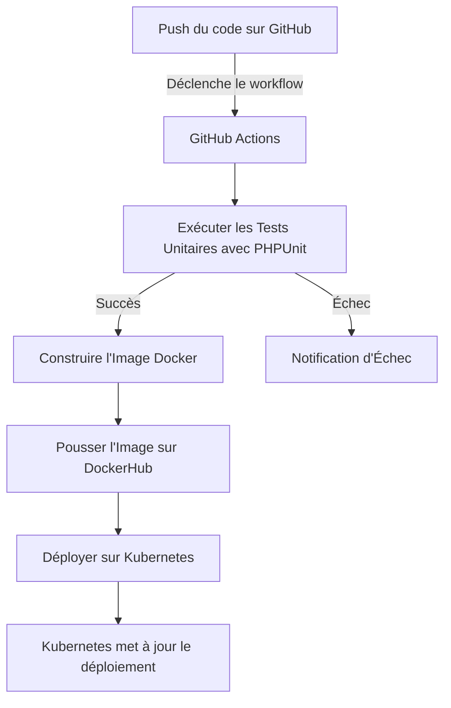

# Application Symfony avec CI/CD utilisant GitHub Actions et Kubernetes

L'objectif principal de ce projet est de démontrer la mise en place d'un pipeline de CI/CD pour automatiser le processus de test, de build, et de déploiement de l'application en utilisant des technologies modernes comme GitHub Actions, DockerHub, et Kubernetes.

# Fonctionnalités

 - **Symfony Framework** : Une application web basique développée avec Symfony.
 - **Dockerisation** : L'application est empaquetée dans un conteneur Docker pour la portabilité et la simplicité du déploiement.
 - **CI/CD** : Intégration et Déploiement Continus mis en place avec GitHub Actions pour assurer la qualité du code et un déploiement automatisé.
 - **Kubernetes** : Déploiement local de l'application sur un cluster Kubernetes pour simuler un environnement de production.

# Qu'est-ce que le CI/CD ?

CI/CD signifie Continuous Integration (Intégration Continue) et Continuous Deployment (Déploiement Continu). C'est un processus permettant d'automatiser les étapes de build, de test et de déploiement des applications. Voici en quoi cela consiste :

 - **Intégration Continue (CI)** : À chaque modification du code source, le système CI construit et teste l'application pour s'assurer que tout fonctionne correctement. Cela permet de détecter et corriger rapidement les erreurs.
 - **Déploiement Continu (CD)** : Après que l'application a passé tous les tests avec succès, le processus de déploiement continu la met automatiquement en production, réduisant ainsi l'intervention manuelle et rendant les mises à jour plus fréquentes et moins risquées.

# GitHub Actions

GitHub Actions est un service d'automatisation qui permet de créer des workflows pour tester, construire, et déployer des applications directement depuis un dépôt GitHub. Dans ce projet, nous utilisons GitHub Actions pour :

 - **Vérifier le code** : À chaque push, l'action GitHub installe les dépendances et lance les tests unitaires avec PHPUnit.
 - **Dockeriser l'application** : L'image Docker de l'application Symfony est construite automatiquement.
 - **Pousser l'image sur DockerHub** : L'image Docker est poussée vers DockerHub, où elle peut être utilisée pour des déploiements ultérieurs.
 - **Déployer sur Kubernetes** : Mettre à jour l'application sur le cluster Kubernetes avec la nouvelle version de l'image.

# Kubernetes

Kubernetes est une plateforme open-source de gestion des conteneurs qui permet de déployer, gérer et mettre à l'échelle des applications conteneurisées. Voici pourquoi Kubernetes est important :

 - **Orchestration des Conteneurs** : Kubernetes permet de gérer les conteneurs Docker (et autres types de conteneurs) en les orchestrant pour qu'ils fonctionnent de manière fiable.
 - **Scalabilité** : Kubernetes vous permet de scaler facilement vos applications en fonction de la charge.
 - **Tolérance aux Pannes** : Grâce à des fonctionnalités comme l'auto-récupération, Kubernetes permet de maintenir la haute disponibilité de vos applications.

Dans ce projet, Kubernetes est utilisé pour gérer l'application Symfony en production, en assurant une disponibilité continue et une mise à jour facile de l'application via un simple changement d'image.

# Schéma du Processus CI/CD

Ce schéma montre les différentes étapes du pipeline CI/CD :

 - **Push du Code** : Tout commence par un push sur la branche principale du dépôt GitHub.
 - **GitHub Actions** : Le workflow est déclenché, et les étapes suivantes sont exécutées automatiquement.
 - **Tests Unitaires** : PHPUnit est utilisé pour tester le code.
 - **Build Docker** : Si les tests sont réussis, une nouvelle image Docker est construite.
 - **Push sur DockerHub** : L'image Docker est poussée sur DockerHub pour le stockage.
 - **Déploiement Kubernetes** : L'image est ensuite déployée sur le cluster Kubernetes, où elle est utilisée pour mettre à jour l'application en production.

# Conclusion

Ce projet vise à illustrer comment une application moderne peut bénéficier de l'automatisation fournie par CI/CD, en particulier avec GitHub Actions et Kubernetes. En automatisant les tests, la construction, et le déploiement, nous réduisons la charge de travail manuelle et assurons une meilleure qualité du logiciel.

N'hésitez pas à expérimenter, améliorer le pipeline, ou adapter ce projet à des besoins plus spécifiques ! Pour toute question, suggestion ou amélioration, n'hésitez pas à ouvrir une issue ou une pull request.
